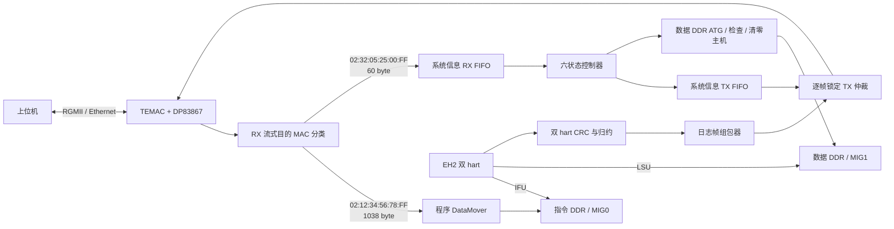
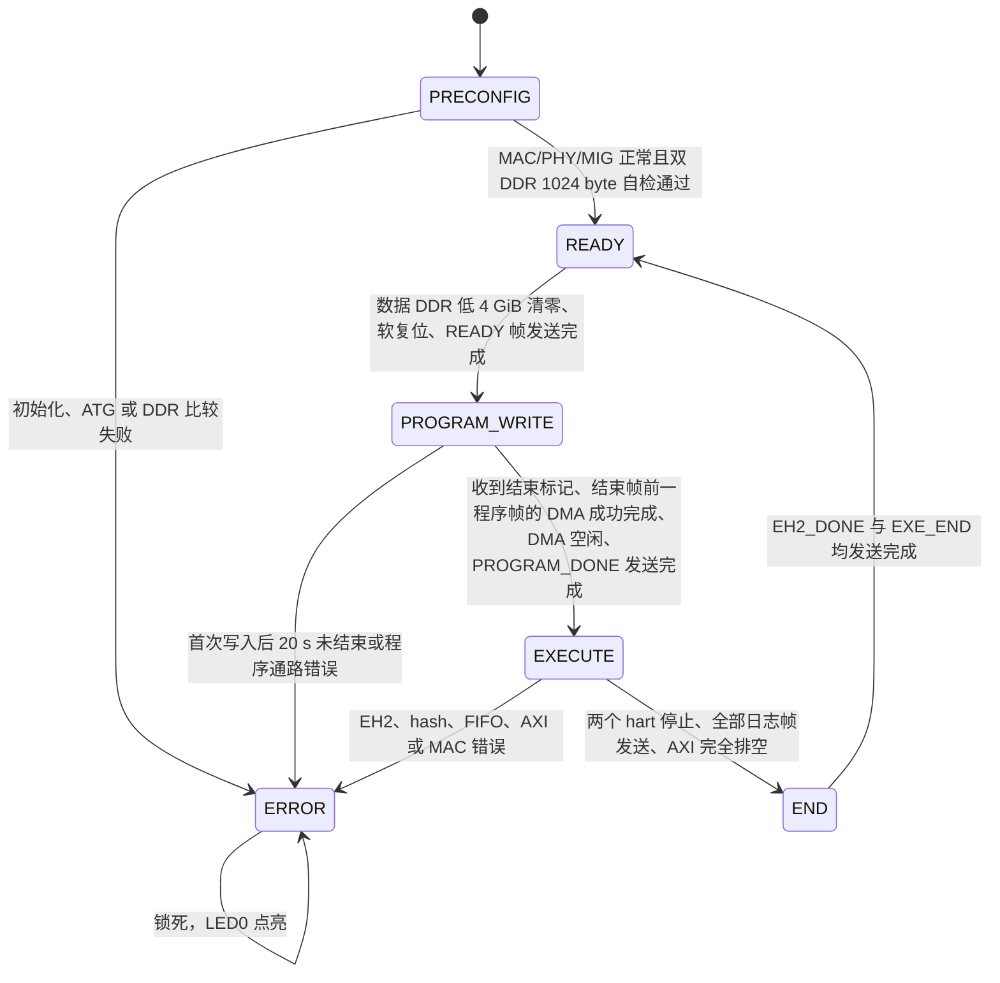

# EH2 双 Hart 以太网加载、执行与日志归约系统

## 1. 系统目标

本工程将四个已上板验证的 Vivado 工程组合为一套完整系统：

- 从以太网接收程序帧，通过 AXI DataMover 写入指令 DDR；
- 使用独立数据 DDR 为 EH2 的 LSU 提供存储空间；
- FPGA 上电后自动完成 MAC、PHY、MIG 和 DDR 通路自检；
- 在 `READY` 阶段用 512 bit MIG UI 原生 AXI 主机清零数据 DDR 的低 4 GiB；
- 在 `EXECUTE` 阶段运行 EH2 的两个 hart；
- 对两个 hart 的提交指令分别执行 CRC-64 和归约；
- 发送 package number、归约值和该 package 内全部 WAW 取消序号；
- 使用独立的系统信息收发 FIFO 上报状态和错误；
- 任一受监测的致命错误发生后发送第一条错误码、进入锁死的 `ERROR` 状态并点亮 `LED0`。

EH2 当前复位向量的字节地址为 `0x8000_0000`。程序 DataMover 的首帧也从指令 DDR 地址 `0x8000_0000` 开始写入，每个合法程序帧使目标地址增加 `0x400`。

## 2. 已复用工程与边界

| 来源工程 | 复用内容 | 本工程中的集成方式 |
| --- | --- | --- |
| `log_eh2_crc_fpga` | EH2 网表、提交指令采集、CRC/归约思路、125 MHz 时钟生成方式 | 综合/实现使用 `netlist/eh2_veer_wrapper.edf`；行为级仿真使用相同配置的 EH2 RTL；归约路径位于 `rtl/crc` |
| `eh2_veri_iss_proj` | EH2 指令/数据外部 AXI 存储结构和处理器初始化流程 | 指令 DDR、数据 DDR、AXI 宽度转换及 DCCM/ICCM 初始化路径 |
| `eth_tx` | TEMAC 发送 FIFO、MAC AXI4-Lite 初始化、RGMII 发送方法 | 复用 TEMAC FIFO 结构；MAC 配置由 ATG 完成；日志帧和系统信息帧共用同一个 TX MAC |
| `mac_fifo_dma_proj` | 以太网 RX FIFO 到 AXI DataMover S2MM 的程序烧写方式 | 每帧固定搬运 1024 byte，写地址从 `0x8000_0000` 连续递增 |

系统只实例化一套全双工 TEMAC 和一颗 DP83867 PHY。接收和发送使用同一物理 MAC/PHY 配置，不存在两套互相不一致的 PHY 初始化。RX 和 TX 客户端各有自己的 FIFO，但都接在同一 TEMAC 上。

## 3. 总体结构



RX 分类器先缓存目的 MAC 的前三个 16 bit word，判别目的地址后以单遍流式方式转发：程序帧的完整 Ethernet frame 进入程序 DataMover，系统帧只把 46-byte payload 写入系统信息 RX FIFO，其余目的地址直接排空并丢弃。分类器在 TLAST 处核对精确帧长，因此两类帧互不污染，同时不会因“整帧缓存后再整帧重放”降低 MAC RX FIFO 的持续排空速率。

早期整帧缓存/重放实现曾在连续程序帧压力下触发 RX FIFO overflow。MAC FIFO 写侧是 8 bit @ 125 MHz（125 MB/s），集成系统读侧是 16 bit @ 100 MHz（200 MB/s），裸带宽本来足够；但旧分类器对 519 个 16-bit word 先采集约 5.19 µs，再在停读 MAC FIFO 时重放约 5.19 µs，单帧服务时间约 10.38 µs，而千兆以太网最小帧间隔下一帧只需约 8.50 µs。流式分类修正后只暂存 3 个 word，最终整机前仿已连续接收 782 帧而无 RX FIFO overflow。

TX 仲裁器在帧首选择来源并锁定到 `TLAST`，不会在一个以太网帧中交叉系统信息和日志数据：

- `PRECONFIG`、`READY`、`PROGRAM_WRITE`、`END` 和 `ERROR`：系统信息 FIFO 使用 MAC；
- `EXECUTE`：日志 FIFO 优先且正常流程中只有日志帧使用 MAC；
- 如果 `EXECUTE` 中出现错误，已开始的日志帧先完整结束，再发送错误信息帧。

## 4. 时钟与复位

| 时钟域 | 频率 | 使用模块 |
| --- | ---: | --- |
| `core_clk` | 50 MHz | EH2、EH2 硬件初始化、提交指令采集、数据 DDR 自检 ATG |
| `ctrl_clk` / 板上 `atg_clk` | 100 MHz | 六状态控制器、程序 DataMover、RX 分类器、系统信息 RX/TX FIFO、系统信息组帧、TX 仲裁、MAC AXI4-Lite 和 PHY MDIO 初始化 |
| `clk125` | 125 MHz | TEMAC GTX 时钟、CRC FIFO 读出与归约、日志结果输出 |
| `refclk` | 约 333.333 MHz | TEMAC 参考时钟 |
| `c0_ui_clk` | 由 MIG0 生成 | 指令 DDR 的 512 bit AXI UI |
| `c1_ui_clk` | 由 MIG1 生成 | 数据 DDR 的 512 bit AXI UI |
| `rgmii_rxc` | 链路提供，千兆时约 125 MHz | TEMAC RGMII 接收；随后由 MAC RX FIFO 跨到 `ctrl_clk` |

状态控制器与两个系统信息 FIFO 都使用 `ctrl_clk=100 MHz`。这样系统状态码、程序结束标记和 MAC 客户端 FIFO 位于同一时钟域，不需要在系统信息路径中再增加异步 FIFO。

硬复位由两个板级开关与 MMCM 锁定状态共同控制。`READY` 中的软复位只复位：

- 程序接收/DataMover 会话状态和写地址；
- 日志组包、WAW 存储和归约会话状态；
- EH2 执行周期。

软复位不会复位：

- TEMAC；
- DP83867；
- 系统信息 RX FIFO；
- 系统信息 TX FIFO；
- 系统信息组帧和发送路径；
- 两个已完成校准的 MIG。

在 EH2 停止后，控制器还会等待 IFU/LSU 的所有已接受 AXI 事务返回，并要求空闲状态连续保持 16 个 `ctrl_clk` 周期，然后才允许进入 `END`、复位 EH2 或在下一轮把 DDR 所有权交给清零主机。

## 5. 地址、MAC 和 EtherType

| 项目 | 值 |
| --- | --- |
| EH2 复位向量 | `0x8000_0000` |
| EH2 `rst_vec[31:1]` 端口值 | `31'h4000_0000` |
| 程序 DataMover 首地址 | `0x8000_0000` |
| 程序帧地址步长 | `0x0000_0400` |
| 程序路径目的 MAC | `02:12:34:56:78:FF` |
| 系统信息路径 MAC | `02:32:05:25:00:FF` |
| 系统信息/日志发送目的 MAC | `FF:FF:FF:FF:FF:FF` |
| 系统信息与日志 EtherType | `0x88B5` |
| 程序帧建议 EtherType | `0x88B6` |
| 执行结束 MMIO 地址 | `0xD058_0000` |
| 执行结束 MMIO 数据 | `0x0032_0525` |

`0x88B5` 和 `0x88B6` 用作本地实验协议，避免被 PC 的 IPv4/ARP 协议栈误处理。RTL 的 RX 隔离以目的 MAC 和精确长度为主要判据；程序控制器还会再次检查程序目的 MAC。

## 6. 六状态控制器



### 6.1 `PRECONFIG`

1. EH2 始终保持复位。
2. 等待下列条件全部满足：
   - 50 MHz 到 125 MHz 的 MMCM 锁定；
   - TEMAC AXI4-Lite ATG 配置完成且无响应错误；
   - DP83867 扫描、ID 校验、RGMII delay 配置和自动协商完成；
   - PHY 链路连续稳定；
   - MIG0、MIG1 校准完成。
3. 通过系统信息 FIFO 发送 `PREINIT_DONE = 0x11111111`。
4. 上位机收到该帧后，按正常程序路径向指令 DDR 发送一帧 1024 byte 的 `0xFF`。该程序 DMA 的 AXI 起始地址为 `0x80000000`；前仿紧凑 DDR 模型把它折叠到内部存储数组第 0 行，但总线地址不是 `0x00000000`。
5. 同时，50 MHz 数据 ATG 向数据 DDR 写入 1024 byte 的 `0xFF`。
6. 收到系统结束标记、确认结束帧前一程序帧的 DMA 成功完成、程序 DMA 空闲且数据 ATG 完成后，独占两个 DDR：
   - 指令 DDR 读取比较 1024 byte；
   - 数据 DDR 读取比较 1024 byte。
7. 两路均正确时发送 `CHECK_PASS = 0x22222222` 并进入 `READY`。
8. 数据或指令 DDR 失败时分别发送 `DATA_FAIL`、`INSTR_FAIL`，随后进入 `ERROR`。

该状态中 DDR0 只允许程序 DataMover/指令检查器访问，DDR1 只允许数据 ATG/数据检查器访问，EH2 没有总线所有权。

### 6.2 `READY`

1. EH2 保持复位。
2. DDR1 所有权只交给 `ddr_fill_master`。
3. 使用 MIG 原有 512 bit AXI UI，以 256 beat、16 KiB 的 INCR burst 清零数据 DDR 的低 4 GiB；不修改 MIG 配置。
4. 清零完成后执行 16 个 `ctrl_clk` 周期的软复位，恢复程序接收地址、日志系统、WAW 存储和错误锁存到新会话初值。
5. TEMAC、PHY、MIG 和系统信息 FIFO 不复位。
6. 发送 `READY = 0x33333333`。
7. 该帧发送完成后进入 `PROGRAM_WRITE`。

硬件参数 `DATA_CLEAR_BYTES` 默认为 `0x1_0000_0000`。完整前仿为缩短时间把该参数改成 1 MiB，但仍使用同一个 512 bit 清零主机和同一条 AXI 路径。

### 6.3 `PROGRAM_WRITE`

1. EH2 保持复位。
2. DDR0 所有权只交给程序 DataMover；DDR1 空闲。
3. 若没有程序帧到达，状态一直等待。
4. 第一次程序 AXI 写地址握手后启动 20 s 计时器：
   - `ctrl_clk=100 MHz`；
   - 超时阈值为 `2,000,000,000` 个周期。
5. 每个合法程序帧固定含 1024 byte payload，依次写入：
   - 第 0 帧：`0x8000_0000`；
   - 第 1 帧：`0x8000_0400`；
   - 依此递增。
6. 上位机发送完最后一帧程序帧后立即发送系统信息结束帧；上位机不知道也不等待 FPGA 内部的 DMA done。
7. RTL 在收到结束帧时锁存当时的程序帧累计数，并等待成功 DMA 完成累计数与其相等；这明确关联了“结束帧前一程序帧”和它自己的 DMA 完成。仅当该条件成立且 DataMover 当前空闲时，才发送 `PROGRAM_DONE = 0x44444444`。只有结束帧，或只有更早程序帧的 DMA 完成，都不能离开本状态。
8. 信息帧发送完成后进入 `EXECUTE`。
9. 超时发送 `PROGRAM_OVERTIME = 0x44440011`，然后进入 `ERROR`。

### 6.4 `EXECUTE`

1. DDR0、DDR1 的所有权都切换到 EH2，保持 16 个 `ctrl_clk` 周期保护时间。
2. EH2 调试复位先释放，hart0 保持 debug halt。
3. `eh2_hw_init` 通过 EH2 DMA slave：
   - 清零 64 KiB DCCM；
   - 清零 64 KiB ICCM；
   - 由 EH2 正常存储路径生成 SECDED ECC；
   - 初始化完成后向 hart0 发出 debug run。
4. hart0 从 `0x8000_0000` 开始执行。
5. 程序开头只有 hart0 执行：

   ```asm
   csrr s0, mhartid
   bnez s0, hart_start_done
   li   t6, 2
   csrw 0x7FC, t6
   hart_start_done:
   ```

6. `CSR 0x7FC[1]=1` 解除 EH2 内部的 hart1 启动门控，hart1 从同一复位向量开始执行。
7. 每个 hart 在结束时向 `0xD0580000` 写 `0x00320525`。日志路径据此停止接收该 hart 的后续提交，并封闭最后一个 package。
8. `EXECUTE` 期间 TX 以日志帧为主，系统状态 FIFO不参与正常发送。
9. 同时满足以下条件才进入 `END`：
   - `stopped == 2'b11`；
   - 两个 hart 的全部 package 归约结果已经发送；
   - IFU/LSU 所有已接受的 AXI 读写事务已经返回；
   - AXI 空闲连续保持 16 个 `ctrl_clk` 周期。

`EXECUTE` 没有运行时间超时，程序可按需要长时间运行。

### 6.5 `END`

1. DDR 所有权仍保留给 EH2，不在状态边界中截断事务。
2. 依次发送：
   - `EH2_DONE = 0x55555555`；
   - `EXE_END = 0x77777777`。
3. 两帧均完成后进入 `READY`。
4. 新一轮 `READY` 会再次清零数据 DDR、复位程序/日志会话并发送新的 `READY`。

### 6.6 `ERROR`

1. 第一条错误优先锁存，后续错误不覆盖它。
2. 若 MAC 正在发送日志帧，先让该帧完整结束。
3. 通过系统信息 FIFO 发送一次对应错误码。
4. EH2 保持复位，DDR 所有者置空。
5. 状态永久保持 `ERROR`。
6. `LED0` 点亮。

## 7. 以太网帧格式

以下长度均不包括线上的 7 byte preamble、1 byte SFD 和 4 byte FCS。TEMAC 负责线侧前导码/SFD/FCS。

### 7.1 程序接收帧

总长度固定为 `14 + 1024 = 1038 byte`。

| 偏移 | 长度 | 内容 |
| ---: | ---: | --- |
| 0 | 6 | 目的 MAC：`02:12:34:56:78:FF` |
| 6 | 6 | 上位机源 MAC；测试程序使用 `02:32:05:25:00:FE` |
| 12 | 2 | 建议 EtherType：`0x88B6` |
| 14 | 1024 | 程序 payload |

程序 payload 不足 1024 byte 时由上位机补零；不能发送短帧。RX 分类器要求帧长精确为 1038 byte，程序控制器还会检查目的 MAC、payload 恰好为 512 个 16 bit word，并等待 DataMover 状态。

当前双 hart 压力程序包含 200,000 条实际静态指令，二进制大小为 800,640 byte；补零到 800,768 byte 后拆成 782 个连续的 1024-byte payload。完整前仿把这 782 个程序帧从测试平台顶层作为真实 RGMII 数据送入 TEMAC RX，经过 RX FIFO、流式分类器、DataMover 和 AXI 转换后写入指令 DDR，并逐字节回读核对全部 800,768 byte；不是用 `$readmemh` 直接预装指令 DDR，也不是用小程序循环制造约 20 万条动态提交。

### 7.2 系统信息接收帧

总长度固定为 `14 + 46 = 60 byte`。

| 偏移 | 长度 | 内容 |
| ---: | ---: | --- |
| 0 | 6 | 目的 MAC：`02:32:05:25:00:FF` |
| 6 | 6 | 上位机源 MAC |
| 12 | 2 | 建议 EtherType：`0x88B5` |
| 14 | 4 | 命令字段 |
| 18 | 42 | 保留，必须填 0 |

只保留目的 MAC 正确且总长度恰好为 60 byte 的帧。46 byte payload 被送入专用 RX FIFO；当 payload 前 4 byte 为 `FF FF FF FF` 时，产生一次程序写入结束脉冲。结束标记帧不会进入程序 DataMover。

### 7.3 系统信息发送帧

总长度固定为 60 byte。

| 偏移 | 长度 | 内容 |
| ---: | ---: | --- |
| 0 | 6 | 目的 MAC：`FF:FF:FF:FF:FF:FF` |
| 6 | 6 | 源 MAC：`02:32:05:25:00:FF` |
| 12 | 2 | EtherType：`0x88B5` |
| 14 | 4 | 32 bit 状态/错误码，大端序 |
| 18 | 2 | 固定为 `03 20`，即字段值 `0x0320` |
| 20 | 40 | 全 0 |

系统信息发送 FIFO 深度为 16 个 32 bit code。格式化器每取出一个 code 就生成一帧，控制器只有在确认该 code 的整帧已经发完后才推进关键状态。

### 7.4 日志归约发送帧

每个 hart 的每个 package 发送一帧，总长度固定为 `14 + 1024 = 1038 byte`。

以太网头：

| 偏移 | 长度 | 内容 |
| ---: | ---: | --- |
| 0 | 6 | 目的 MAC：广播 |
| 6 | 6 | 源 MAC：`02:12:34:56:78:FF` |
| 12 | 2 | EtherType：`0x88B5` |

1024 byte payload：

| payload 偏移 | 长度 | 内容 |
| ---: | ---: | --- |
| 0 | 2 | `package_number`，大端序 |
| 2 | 1 | bit0=`hart_id`，其余位 0 |
| 3 | 1 | 保留，0 |
| 4 | 4 | 本 package 的有效归约条目数，大端序 |
| 8 | 8 | `xor0`，大端序 |
| 16 | 8 | `xor1`，大端序 |
| 24 | 8 | `sum0`，大端序 |
| 32 | 8 | `sum1`，大端序 |
| 40 | 8 | `sum2`，大端序 |
| 48 | 8 | `sum3`，大端序 |
| 56 | 2 | WAW 取消序号数量，9 bit 有效，大端序 |
| 58 | `2*N` | 依提交顺序排列的 WAW `sequence_number`，每项 16 bit 大端序 |
| `58+2*N` | 其余 | 全 0 |

固定字段共占 58 byte，因此 1024 byte payload 最多保存：

```text
(1024 - 58) / 2 = 483
```

个 WAW 序号。系统不会把一个 package 拆为多帧；同一 hart、同一 package 出现第 484 个 WAW 取消事件时进入 `ERROR`，分别上报 `ERR_WAW_HART0` 或 `ERR_WAW_HART1`。

## 8. 系统信息码

### 8.1 正常状态与自检

| Code | 符号 | 含义 |
| --- | --- | --- |
| `0x11111111` | `MSG_PREINIT_DONE` | MAC、PHY 和双 MIG 初始化完成，可以开始上电通路检查 |
| `0x22222222` | `MSG_CHECK_PASS` | 指令 DDR 与数据 DDR 的 1024 byte `0xFF` 检查均通过 |
| `0x22220011` | `MSG_DATA_FAIL` | 数据 DDR 自检失败，发送后进入 `ERROR` |
| `0x22220022` | `MSG_INSTR_FAIL` | 指令 DDR 自检失败，发送后进入 `ERROR` |
| `0x33333333` | `MSG_READY` | 数据 DDR 清零和会话软复位完成，可以发送程序 |
| `0x44444444` | `MSG_PROGRAM_DONE` | 已收到程序结束标记、结束帧前一程序帧的 DMA 已成功完成，且 DataMover 当前空闲 |
| `0x55555555` | `MSG_EH2_DONE` | 两个 hart 均结束，全部日志帧已发送，EH2 AXI 已排空 |
| `0x77777777` | `MSG_EXE_END` | 本次执行会话正式结束，随后回到 `READY` |

### 8.2 程序写入错误

| Code | 符号 | 含义 |
| --- | --- | --- |
| `0x44440011` | `ERR_PROGRAM_OVERTIME` | 第一次程序 DDR 写入后 20 s 内未收到结束标记 |
| `0x44440022` | `ERR_PROGRAM_WRITE` | 程序帧长度、DataMover 状态或写事务错误 |
| `0x44440033` | `ERR_PROGRAM_FIFO` | 预留的程序接收 FIFO 专用错误码；当前共用 MAC RX FIFO overflow 同时连到优先级更高的 `ERR_RX_FRAME_BUF` |
| `0x44440044` | `ERR_PROGRAM_DMA` | AXI DataMover 报错 |

### 8.3 运行与基础设施错误

| Code | 符号 | 含义 |
| --- | --- | --- |
| `0x66660011` | `ERR_NB_HART0` | hart0 nonblocking instruction buffer 冲突/溢出 |
| `0x66660012` | `ERR_NB_HART1` | hart1 nonblocking instruction buffer 冲突/溢出 |
| `0x66660021` | `ERR_HASH_HART0` | hart0 to-hash FIFO overflow |
| `0x66660022` | `ERR_HASH_HART1` | hart1 to-hash FIFO overflow |
| `0x66660033` | `ERR_TXMAC_FIFO` | TEMAC TX FIFO overflow |
| `0x66660044` | `ERR_TXMAC_STREAM` | TX AXI stream/日志待发送缓存异常 |
| `0x66660051` | `ERR_WAW_HART0` | hart0 某 package 的 WAW 数超过 483 |
| `0x66660052` | `ERR_WAW_HART1` | hart1 某 package 的 WAW 数超过 483 |
| `0x66660061` | `ERR_BANK_HART0` | hart0 package 奇偶 bank 未释放即被重用 |
| `0x66660062` | `ERR_BANK_HART1` | hart1 package 奇偶 bank 未释放即被重用 |
| `0x66660071` | `ERR_INFO_RX_FIFO` | 系统信息 RX FIFO overflow |
| `0x66660072` | `ERR_INFO_TX_FIFO` | 系统信息 TX FIFO overflow |
| `0x66660073` | `ERR_RX_FRAME_BUF` | 共用 MAC RX FIFO overflow，或分类器识别帧超过最大保护长度 |
| `0x66660074` | `ERR_RX_FRAME_LEN` | 目的 MAC 被识别但帧长不符合协议、系统 payload 长度错误或程序 payload 长度错误 |
| `0x66660081` | `ERR_MAC_CONFIG` | TEMAC AXI4-Lite 初始化失败 |
| `0x66660082` | `ERR_PHY_INIT` | DP83867 扫描、ID 或 RGMII 配置失败 |
| `0x66660083` | `ERR_PHY_LINK` | PHY 自动协商/稳定链路失败或运行时链路丢失 |
| `0x66660091` | `ERR_MIG0` | 指令 DDR MIG 校准超时 |
| `0x66660092` | `ERR_MIG1` | 数据 DDR MIG 校准超时 |
| `0x666600A1` | `ERR_DDR_ZERO` | 数据 DDR 清零主机收到 AXI 错误响应 |
| `0x666600A2` | `ERR_DDR_CHECK` | DDR 检查主机发生 AXI 错误 |
| `0x666600B1` | `ERR_EH2_INIT` | DCCM/ICCM 初始化或 debug run 失败 |
| `0x666600B2` | `ERR_EH2_IFU_AXI` | EH2 IFU AXI 错误响应 |
| `0x666600B3` | `ERR_EH2_LSU_AXI` | EH2 LSU AXI 错误响应 |
| `0x666600F1` | `ERR_ILLEGAL_STATE` | 控制器进入未定义 phase/state |

错误监测器采用 first-error-wins。上表中的先后顺序也是同一周期多个错误同时出现时的优先级。

本工程只实现本表列出的系统信息符号；Excel 中多出的信号未加入协议。

## 9. Hash 与归约算法

### 9.1 160 bit 指令结构

每条被归约的指令构造为：

```text
instruction_struct[159:0] = {
    package_number[15:0],
    sequence_number[15:0],
    pc[31:0],
    instruction[31:0],
    metadata[31:0],
    data[31:0]
}
```

其中：

```text
metadata = {
    15'b0,
    hart_id[0],
    privilege_mode[1:0],
    event_type[1:0],
    register_number[11:0]
}
```

`event_type`：

- `0`：无寄存器写事件；
- `1`：GPR 事件，`register_number` 为 `rd`；
- `2`：CSR 事件，`register_number` 为 CSR 地址。

事件选择优先级：

1. WAW victim：记录 GPR 号，`data=0`；
2. CSR write：记录 CSR 地址和写入数据；
3. 已完成的 GPR write：记录 `rd` 和实际写回数据；
4. nonblocking load/div 写回意图：同周期返回则直接使用返回值，否则把结构保存到对应 hart/rd 的 nonblocking buffer，等待结果后再计算 CRC；
5. 其他指令：event、register 和 data 均为 0。

WAW 取消的原指令序号不丢弃，而是另外写入 WAW sequence store，最终随同该 package 的归约值发送。

### 9.2 Package 和序号

- 两个 hart 分别计数；
- 每个 hart 的 `sequence_number` 从 0 开始；
- 一个 package 最多包含 65536 个序号，即 `0x0000` 到 `0xFFFF`；
- `sequence_number==0xFFFF` 后序号回到 0，`package_number+1`；
- package 奇偶位选择双 bank，允许上一 package 归约/发送时继续采集下一 package；
- bank 在发送完成前不得被同一 hart 的后续同奇偶 package 重用，否则报 bank conflict。

### 9.3 CRC-64

采用非反射 CRC-64/ECMA-182：

```text
polynomial = 0x42F0E1EBA9EA3693
```

160 bit 消息按 bit159 到 bit0、MSB first 输入。

同一结构计算两个 CRC：

```text
c0 = CRC64(message, init=0x0000000000000000)
c1 = CRC64(message, init=0xFFFFFFFFFFFFFFFF)
```

对于固定 160 bit 长度，第二个 CRC 使用 CRC 仿射性质实现为：

```text
c1 = c0 XOR 0xC2D822EDD2DBFBB1
```

该实现保持与双 CRC 网络相同的数值，但只需要一套数据相关的 160 级组合 CRC 网络。

### 9.4 G 混合与归约

定义 64 bit 循环左移 `ROTL`，所有加法均模 `2^64`：

```text
K0 = 0x9E3779B97F4A7C15
K1 = 0xD1B54A32D192ED03

g0 = c0 + ROTL(c1, 17) + K0
g1 = c1 + ROTL(c0, 31) + K1
g2 = (c0 XOR ROTL(c1, 43)) + ROTL(c0, 11)
g3 = (c1 XOR ROTL(c0, 29)) + ROTL(c1, 7)
```

每个 hart、每个 package 的最终结果：

```text
xor0 = XOR(all g0)
xor1 = XOR(all g1)
sum0 = SUM(all g0) mod 2^64
sum1 = SUM(all g1) mod 2^64
sum2 = SUM(all g2) mod 2^64
sum3 = SUM(all g3) mod 2^64
count = 参与归约的有效条目数
```

CRC 采集在 50 MHz EH2 提交域完成，异步多写单读 FIFO 把 CRC pair 送到 125 MHz 归约域。每个 hart 有两个 package bank；日志结果和 WAW 事件再安全跨到 100 MHz 组帧域。

## 10. 主要模块

### 10.1 顶层与公共模块

| 模块 | 功能与构造 |
| --- | --- |
| `rtl/eh2_veri_system_top.sv` | 系统顶层；实例化时钟、TEMAC、双 MIG、EH2、DDR 主机、状态机、错误监测和全部 CDC |
| `rtl/common/eh2_system_pkg.sv` | 六状态枚举、DDR owner 枚举、MAC 地址和全部消息码 |
| `rtl/common/axi4_if.sv` | 统一 AXI4 interface 定义 |
| `rtl/common/axi_owner_mux2.sv` | 两主机逐阶段 AXI owner mux；状态机保证只在前一所有者空闲后切换 |
| `rtl/common/sync_bits.sv` | 多级位同步器 |
| `rtl/common/sync_fifo.sv` | 系统信息同步 FIFO 基础模块 |

### 10.2 控制与错误模块

| 模块 | 功能与构造 |
| --- | --- |
| `rtl/control/eh2_system_controller.sv` | 六状态控制器；管理初始化、自检、4 GiB 清零、20 s 程序超时、EH2 释放、END/ERROR 消息和 DDR owner |
| `rtl/control/system_error_monitor.sv` | 同步错误源 first-error-wins 编码和锁存 |

### 10.3 以太网与程序加载模块

| 模块 | 功能与构造 |
| --- | --- |
| `rtl/eth/ethernet_subsystem.sv` | 一套全双工 TEMAC、MAC 配置 ATG、DP83867 初始化和客户端 FIFO |
| `rtl/eth/eth_mac_fifo_block.v` | TEMAC 与 RX 8-to-16、TX 8 bit FIFO 封装 |
| `rtl/eth/dp83867_phy_init.v` | 扫描 PHY 地址、核对 ID、配置 RGMII_ID delay、重启自动协商并等待稳定链路 |
| `rtl/eth/eth_rx_frame_classifier.sv` | 缓存目的 MAC 的 3 个 16 bit word后流式分流；程序帧送 DMA、系统 payload 送专用 FIFO，并在 TLAST 核对精确长度 |
| `rtl/eth/program_rx_dma_ctrl.v` | 丢弃 14 byte 头、生成 1024 byte DataMover 命令、检查帧长/状态、地址加 `0x400` |
| `rtl/eth/program_dma_subsystem.sv` | DataMover S2MM 与程序控制器封装，起始地址固定 `0x80000000` |
| `rtl/eth/system_info_rx_fifo.sv` | 128 项、16 bit 的专用系统信息接收 FIFO |
| `rtl/eth/system_info_rx_decoder.sv` | 检查 46 byte payload，识别前 4 byte 全 `FF` 的结束标记 |
| `rtl/eth/system_info_tx_fifo.sv` | 16 项、32 bit code 的专用系统信息发送 FIFO |
| `rtl/eth/system_info_tx_formatter.sv` | 把一个 code 组装为固定 60 byte 广播帧 |
| `rtl/eth/system_tx_arbiter.sv` | 信息/日志 TX 帧级锁定仲裁，不允许帧内交叉 |

### 10.4 DDR 模块

| 模块 | 功能与构造 |
| --- | --- |
| `rtl/ddr/dual_ddr_mig_wrapper.sv` | 两个现有 MIG 的硬件封装 |
| `rtl/ddr/axi32_to_512_cdc.sv` | 程序/ATG 的 32 bit AXI 跨时钟并转换到 512 bit MIG UI |
| `rtl/ddr/axi64_to_512_cdc.sv` | EH2 IFU/LSU 的 64 bit AXI 跨时钟并转换到 512 bit MIG UI |
| `rtl/ddr/data_test_atg_wrapper.sv` | 50 MHz 数据 DDR 1024 byte `0xFF` 写入 ATG |
| `rtl/ddr/ddr_read_compare_master.sv` | 原生 512 bit AXI 读取并逐 byte 比较自检区域 |
| `rtl/ddr/ddr_fill_master.sv` | 原生 512 bit、256 beat burst 的低 4 GiB 快速清零主机 |

### 10.5 EH2、Hash 与日志模块

| 模块 | 功能与构造 |
| --- | --- |
| `rtl/eh2/eh2_core_crc_subsystem.sv` | EH2 网表/RTL 包装、复位向量、hart 启动策略、硬件初始化和提交信号接线 |
| `rtl/eh2/eh2_hw_init.sv` | 通过 EH2 DMA slave 清零 DCCM/ICCM 并发出 hart0 debug run |
| `rtl/eh2/eh2_veer_wrapper_mt_stub.v` | 综合使用 EDIF 时的多 hart 端口声明 |
| `rtl/crc/instr_crc_hash_dual.sv` | 双 hart 序号、WAW/nonblocking 处理、160 bit 结构和 CRC 生成 |
| `rtl/crc/crc64_ecma_pair_160.sv` | CRC-64/ECMA-182 与双 seed 仿射实现 |
| `rtl/crc/crc_pair_fifo_async_4w1r.sv` | 每周期最多四项写入、单读出的异步 CRC FIFO |
| `rtl/crc/crc_mix_accumulator.sv` | G 混合及 XOR/SUM package 归约 |
| `rtl/crc/instr_crc_system_dual.sv` | 双 hart、双 bank CRC/归约系统封装 |
| `rtl/log/log_result_cdc.sv` | 归约结果从 125 MHz 跨到 100 MHz |
| `rtl/log/waw_event_cdc.sv` | WAW 事件从 50 MHz 跨到 100 MHz |
| `rtl/log/waw_sequence_store.sv` | 每 hart、每奇偶 package bank 最多保存 483 个 WAW 序号 |
| `rtl/log/log_frame_packetizer.sv` | 快照一个归约结果和对应 WAW 列表，生成固定 1038 byte 日志帧 |

## 11. LED

| LED | 含义 |
| ---: | --- |
| 0 | `ERROR` 锁死指示 |
| 1 | MAC 配置完成且无错误 |
| 2 | PHY 初始化成功 |
| 3 | MIG0 校准完成 |
| 4 | MIG1 校准完成 |
| 5 | 当前为 `PROGRAM_WRITE` |
| 6 | 当前为 `EXECUTE` |
| 7 | 当前为 `END` |

## 12. 双 Hart 启动异常：原因与解决办法

### 12.1 错误现象

第一次完整系统长仿真中：

```text
mhartstart=11
hart0 commit > 0
hart1 commit = 0
```

`mhartstart=11` 证明 hart0 的：

```asm
li   t6, 2
csrw 0x7FC, t6
```

确实已经把 hart1 启动位写成 1。因此问题不在程序的 hart0 条件分支，也不在 CSR 地址或写入值，而发生在 hart1 被解除 `MHARTSTART` 门控之后的复位/运行模式。

### 12.2 根因

EH2 的 MPC 复位控制满足：

```text
take_reset = reset_allowed & mpc_reset_run_req
```

原连接为：

```systemverilog
.mpc_reset_run_req(2'b00)
.mpc_debug_run_req({1'b0, hw_run_req})
```

它对 hart0 是有意的：hart0 复位后先进入 debug halt，`eh2_hw_init` 才能清零 DCCM/ICCM，之后 `hw_run_req` 启动 hart0。

但同样的 `mpc_reset_run_req[1]=0` 也作用于稍后才由 `CSR 0x7FC[1]` 释放的 hart1。hart1 解除 `MHARTSTART` 后进入 MPC debug halt，而 `mpc_debug_run_req[1]` 永远为 0，因此它虽然显示“已启动”，却不会提交任何指令。

### 12.3 修复

连接改为：

```systemverilog
.mpc_reset_run_req(2'b10)
.mpc_debug_run_req({1'b0, hw_run_req})
```

效果：

- bit0 仍为 0：hart0 保持原有“复位后 debug halt → 初始化 DCCM/ICCM → debug run”流程；
- bit1 为 1：hart1 在被 `MHARTSTART` 释放后直接取复位向量运行；
- hart1 不会提前运行，因为 `MHARTSTART` 门控仍然存在，只有 hart0 写 `CSR 0x7FC[1]` 后才释放。

测试平台增加了两个直接断言点：

```text
HARTSTART_CSR_COMMIT hart=0 lane=0 pc=8000000c data=00000002
HART1_FIRST_COMMIT  lane=0 pc=80000000 insn=f1402473
```

修复后的仿真中，两者只相差约 520 ns。当前 200,000 条静态指令程序最终提交数为 hart0=100023、hart1=100021，说明 hart1 已从复位向量稳定执行，而不是只改变了启动状态位。

## 13. 前仿与 Spike 验证

### 13.1 Spike

硬件 ELF 保留真实的 `csrw 0x7FC,t6`。当前虚拟机里的标准 Spike 不实现 EH2 私有 CSR `0x7FC`，所以只为 Spike 另建兼容 ELF：

- Spike 兼容 ELF 在该位置临时使用 `nop`；
- Spike 运行后，把 hart0 对应 commit 记录恢复成真实 CSR 指令和写值；
- 设置 `mhartstart=2`，由日志后处理生成与硬件语义一致的双 hart 黄金记录；
- 硬件执行的 ELF 本身不做该替换。

最终 Spike/EH2 提交记录比较条目数为 200044，精确匹配 200044，mismatch 为 0，WAW 容差使用量为 0。

### 13.2 完整 RGMII 前仿覆盖

完整测试平台使用：

- 真实 TEMAC 行为模型和客户端 FIFO；
- RGMII nibble、RX clock、前导码、SFD 和 Ethernet FCS；
- RX 流式目的 MAC 分类器；
- 系统信息 RX/TX FIFO；
- 程序 AXI DataMover；
- AXI clock converter 和 data width converter；
- 两个 1 MiB、512 bit AXI DDR UI 行为模型；
- 完整 EH2 RTL；
- 双 hart CRC、归约和日志帧；
- `END → READY` 的第二轮状态转换。

MIG 的物理 DDR4 模型在前仿中被紧凑 AXI UI 内存替换，PHY MDIO 初始化因没有串行 PHY 模型而旁路；硬件工程的默认参数仍启用真实 DP83867 初始化和完整低 4 GiB 清零。

最终长仿真必须同时满足：

- 系统信息码顺序为  
  `11111111 → 22222222 → 33333333 → 44444444 → 55555555 → 77777777 → 33333333`；
- 两个 hart 都提交指令；
- hart0 确实提交 `CSR 0x7FC = 2`；
- 共发送四个日志帧；
- 四个日志帧的 package、count、六个归约值全部等于 Spike 黄金值；
- TX 真实产生 RGMII 活动；
- 两个 DDR AXI 内存模型无协议错误；
- `LED0=0`；
- 无 `$fatal`。

本轮最终结果为：

```text
FULL_SYSTEM_RGMII_PASS frames=11 info=7 log=4 rgmii_cycles=4704 ddr_writes=12528/58026
FULL_SYSTEM_FRAME_PASS frames=11 info=7 log=4 errors=0
```

日志中：

- `Fatal: 0`；
- `AXI_PROTOCOL_ERROR: 0`；
- 标准错误输出为 0 byte；
- `LED0` 未置位；
- `END` 后再次完成数据 DDR 清零并发送第二个 `READY`。

四个实际发送的日志帧与 Spike 黄金值如下：

| Hart | Package | Count | WAW | xor0 | xor1 | sum0 | sum1 | sum2 | sum3 |
| ---: | ---: | ---: | ---: | --- | --- | --- | --- | --- | --- |
| 0 | 0 | 65536 | 0 | `76ccccb33aaa814b` | `93fc4eadc39c0713` | `d79da9c4a8c1172b` | `71a8e130b96ce23d` | `e78ed7cd07513416` | `8065836600100d79` |
| 1 | 0 | 65536 | 0 | `794867dc6f2e5813` | `d6fca41457959ea0` | `111d6cd4dede4589` | `f556f6ccda59d924` | `c525a2ab348fe23e` | `d42e5338c37d4d31` |
| 0 | 1 | 34487 | 0 | `67be0dba06d069b8` | `5b3e9695c386e524` | `809873b9ea0e88de` | `e71f46f42d15c7aa` | `0b124b71370e9c7a` | `6bb71317ab29c8e0` |
| 1 | 1 | 34485 | 0 | `ec93f7c948ad16d7` | `2606358a233531bd` | `b9c6d21d8ff3f0ff` | `3bbb835997d4fcaf` | `799dc9857deec68b` | `ba99c046d6da89b5` |

调试过程中曾出现过一条测试平台 AXI 协议错误。诊断打印把首个触发点定位到 `PRECONFIG` 数据 ATG 的合法 `AWSIZE=2` 窄写。旧 DDR 行为模型错误地要求 512 bit AXI UI 上所有事务必须为 `AWSIZE=6`，并且固定按 64 byte 增加地址。修正后模型：

- 接受 `AWSIZE <= 6` 的 AXI4 INCR burst；
- 窄事务按 `1 << AxSIZE` 增加地址；
- 由 `AxADDR[5:0]` 和 `WSTRB` 选择 512 bit 总线中的有效 byte lane。

修正后的完整重跑先通过 1024 byte `0xFF` 写入/读取比较，再完成双 hart 执行；最终无 AXI 协议错误。该问题只在前仿 DDR 行为模型中，不是 MIG、DataMover 或 EH2 的硬件协议错误。

最终仿真输出和逐帧黄金值核对文件位于：

```text
artifacts/sim/full_system_vivado.log
artifacts/sim/full_system_tx_frames.log
artifacts/sim/full_system_frame_verify.json
artifacts/sim/eh2_spike_straight_200k_compare.json
artifacts/sim/spike_straight_200k_golden.json
```

## 14. 构建与验证命令

在工程根目录执行：

```powershell
D:\vivado23\Vivado\2023.2\bin\vivado.bat -mode batch -source scripts\create_project.tcl
powershell -ExecutionPolicy Bypass -File scripts\build_stress_program.ps1
powershell -ExecutionPolicy Bypass -File scripts\run_unit_sims.ps1
D:\vivado23\Vivado\2023.2\bin\vivado.bat -mode batch -source scripts\run_full_system_sim.tcl
python scripts\verify_full_system_frames.py artifacts\sim\full_system_tx_frames.log artifacts\sim\spike_straight_200k_golden.json --json artifacts\sim\full_system_frame_verify.json
```

生成的 Vivado 工程：

```text
build/vivado/eh2_veri_system.xpr
```

综合命令：

```powershell
D:\vivado23\Vivado\2023.2\bin\vivado.bat -mode batch -source scripts\run_synthesis.tcl
```

综合和实现使用 EH2 EDIF 网表；完整行为级前仿用相同配置的 EH2 RTL 替代 EDIF，以便观察双 hart 提交信号。

## 15. 仍需用户决定的初始化/保护项目

当前系统已经实现正常工作所需的板级复位、MMCM、TEMAC、DP83867、双 MIG、自检、DDR1 清零、EH2 DCCM/ICCM 和会话软复位。以下项目不是当前功能的前提，但在最终长期运行产品中可考虑增加：

1. **外部时钟发生器初始化**：当前假设板卡已由上电配置提供 50 MHz、100 MHz、333.333 MHz 和 MIG 参考时钟。如果板上 SI5338/同类器件并非自动配置，需要增加主机或 FPGA 内部 I²C 初始化。
2. **指令 DDR 全空间清理**：当前每次程序会话只覆盖实际收到的连续 1024 byte 块；不会清零未被新程序覆盖的旧指令区。若软件可能跳到旧区域，可增加指令 DDR image 范围清理或长度上限保护。
3. **运行期 PHY 自动恢复**：当前链路丢失被视为致命错误并进入 `ERROR`。如需无人值守恢复，可增加重新协商、重新配置和有限次数重试。
4. **应用层完整性与会话号**：当前依赖 Ethernet FCS、目的 MAC、精确帧长和 DataMover 状态。若需检测丢帧、重复帧或错序，可在 1024 byte 程序 payload 中增加 frame index、总长度和 image CRC。
5. **DDR ECC scrub**：如果最终 MIG 打开 ECC，可在上电后增加全空间 scrub；当前工程沿用现有 MIG 配置，不额外改变 ECC 设置。
6. **系统信息可靠确认**：系统信息帧当前是广播且不重传。若上位机必须保证收到每一个状态，可增加 ACK/序号/超时重发，但这会改变现有协议和状态推进条件。

以上项目均未擅自加入，避免改变四个已验证参考工程的板级假设和当前上位机协议。
